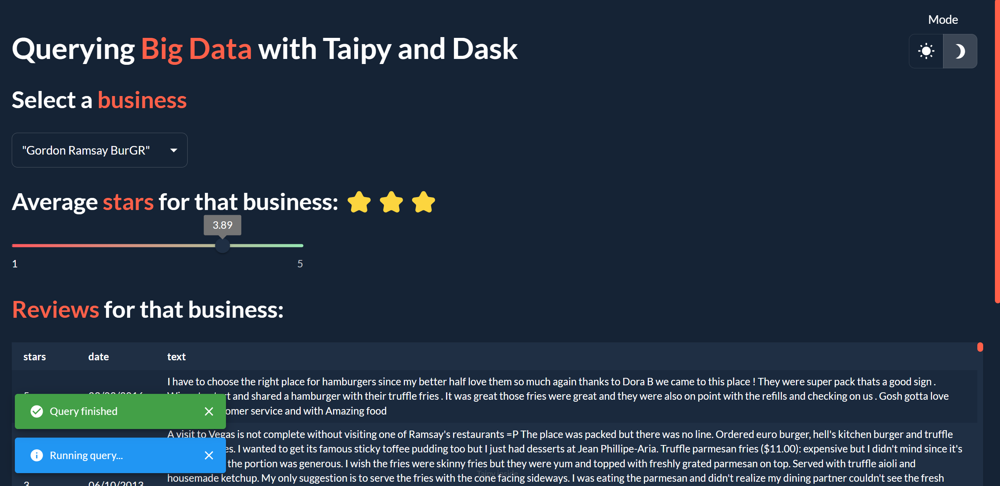
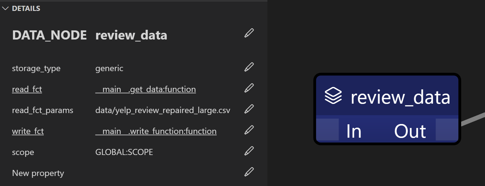
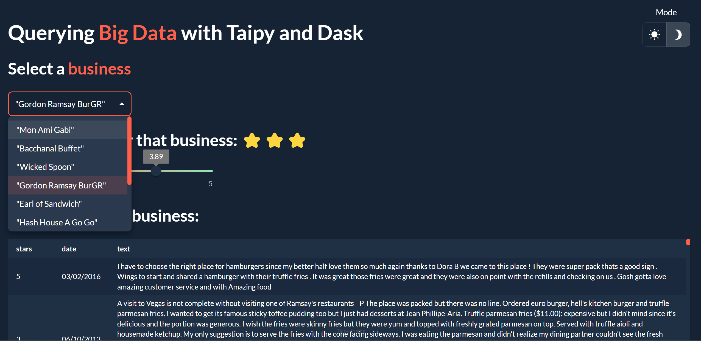

# Querying Big Data using Taipy and Dask

<p align="center">
    </img>
</p>

This project uses Taipy to create a Dask pipeline to run queries on a 24Gb dataset of Yelp Reviews and build a web app to run these queries and display the results.

Taipy is a great way to manage and display the results of Dask applications, as its backend is built for large-scale applications and can handle caching, parallelization, scenario management, pipeline versioning, data scoping, etc.


## Table of Contents

- [Table of Contents](#table-of-contents)
- [Why Taipy?](#why-taipy)
- [Why Dask?](#why-dask)
- [Datasets](#datasets)
- [Data Pipeline](#data-pipeline)
- [Web App](#web-app)
- [How to Run](#how-to-run)

## Why Taipy?
Taipy is an open-source Python library that manages both front and back-end:
- Taipy GUI helps create web apps quickly using only Python code
- Taipy Core manages data pipelines through a visual editor where parallelization, caching and scoping are easily defined

## Why Dask?
Pandas is an excellent library for data analysis, but it is not designed to handle large datasets. Dask is a library that extends Pandas to parallelize computations and handle ("out-of-core") datasets.

## Datasets

The datasets used in this project are based on Yelp Reviews datasets:
- `data/yelp_business.csv` contains the reference information about businesses (mainly name and id)
- `data/yelp_review.csv` is a 24Gb dataset containing Yelp reviews (mainly business id, text, and stars)

The goal will be to join these two datasets and run queries to find average stars and reviews for a specific business.

## Data Pipeline

The Data Pipeline is built using Taipy Studio in VSCode and looks like this:

<p align="center">
    </img>
</p>

Blue nodes are **Data Nodes** that store Python variables or datasets:

<p align="center">
    </img>
</p>

- business_data is the `yelp_business.csv` dataset represented as a Pandas DataFrame
- business_dict is a dictionary mapping business ids to business names
- business_name is the name of the business we want to query
- business_id is the id of the business we want to query
- review_data is the `yelp_review.csv` dataset as a Dask DataFrame

<p align="center">
    </img>
</p>

review_data is a *generic* data node that calls a Python function `read_fct` to read the dataset with a `read_fct_params` argument to specify the path.

<p align="center">
    </img>
</p>

- raw_reviews contains the reviews that we queried
- parsed_reviews is raw_reviews but filtered only to contain relevant columns

Between the data nodes (in blue) are **Task Nodes** (in orange). Task Nodes take Data Nodes as inputs and return Data Nodes as outputs using Python functions.

<p align="center">
    </img>
</p>

These Task Nodes are combined into a pipeline using a green node called the Pipeline** Node**, which is the entry point of the pipeline. (Note that Taipy allows for several Pipelines Nodes to co-exist)   
Task Nodes have a skippable property that allows them to be skipped if the output was already computed and cached.

Example:
- Let’s set the parameter skippable to True for the get_reviews task.
- Let’s run the pipeline once
- Then run it a second time, Taipy will log:
- `[2023-05-16 04:40:06,858][Taipy][INFO] job JOB_getread_reviews_39d2bb45-8901-4081-b877-2e308507bb90 is skipped.`
- meaning it did not reread the dataset but used the cached result instead.


## Web App

The web app is built using Taipy GUI and looks like this:

<p align="center">
    </img>
</p>

The app allows you to select a business from a dropdown menu. This will call the pipeline, run the query in 5 minutes and display the results: average stars and reviews for the selected business.

## How to Run

You can run the app using this repo which contains a smaller version of the dataset (30Mb):

1. Clone the repository
```
git clone https://github.com/AlexandreSajus/Taipy-Dask-Demo.git
```

2. Install the requirements
```
pip install -r requirements.txt
```

1. Run the web app
```
python app.py
```