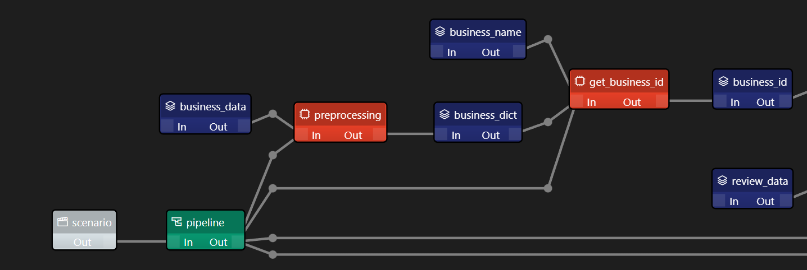
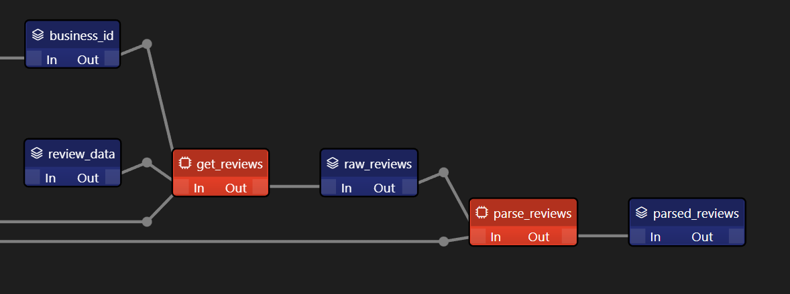

# Querying Big Data using Taipy and Dask

    </img>

This projects focuses on using Taipy to create a Dask pipeline to run queries on a 24Gb dataset of Yelp Reviews and to build a web app to run these queries and display the results.

## Table of Contents

- [Why Taipy?](#why-taipy)
- [Why Dask?](#why-dask)
- [Datasets](#datasets)
- [Data Pipeline](#data-pipeline)
- [Web App](#web-app)

## Why Taipy?
Taipy is an open-source Python library that manages both front and back-end:
- Taipy GUI helps create web apps quickly using only Python code
- Taipy Core helps manage data pipelines by visualizing them and caching already computed results

## Why Dask?
Pandas is a great library when it comes to data analysis, but it is not designed to handle large datasets. Dask is a library that extends Pandas to parallelize computations and handle bigger than memory datasets.

## Datasets

The datasets used in this project are based on Yelp Reviews datasets:
- `data/yelp_business.csv` contains information about businesses (mainly name and id)
- `data/yelp_review_repaired_large.csv` is a 24Gb dataset containing Yelp reviews (mainly business id, text and stars)

The goal here will be to join these two datasets and run queries to find average stars and reviews for a specific business.

## Data Pipeline

The Data Pipeline is built using Taipy Studio in VSCode and looks like this:

    </img>

Blue nodes are **Data Nodes** which store variables or datasets:

    </img>

- business_data is the `yelp_business.csv` dataset as a Pandas DataFrame
- business_dict is a dictionary mapping business ids to business names
- business_name is the name of the business we want to query
- business_id is the id of the business we want to query
- review_path is the path to the `yelp_review_repaired_large.csv` dataset
- review_data is the dataset as a Dask DataFrame

    </img>

- raw_reviews is the reviews that we queried
- parsed_reviews is raw_reviews but filtered to only contain relevant columns

Between the blue nodes are orange **Task Nodes** which take blue nodes as inputs and return blue nodes as outputs using Python functions.

    </img>

These **Task Nodes** are called by a green node called **Pipeline Node** which is the entry point of the pipeline.
- **Task Nodes** have a skippable property which allows them to be skipped if the output was already computed and cached
- For example, if we already ran a first query and then run a second one, Taipy will log:
- `[2023-05-16 04:40:06,858][Taipy][INFO] job JOB_read_review_39d2bb45-8901-4081-b877-2e308507bb90 is skipped.`
- meaning it did not read the dataset again but used the cached result instead.

With this pipeline, we can find reviews for a specific business from the datasets.

## Web App

The web app is built using Taipy GUI and looks like this:

    </img>

The app allows you to select a business from a dropdown menu. This will call the pipeline, run the query and display the results: average stars and reviews for the selected business.

